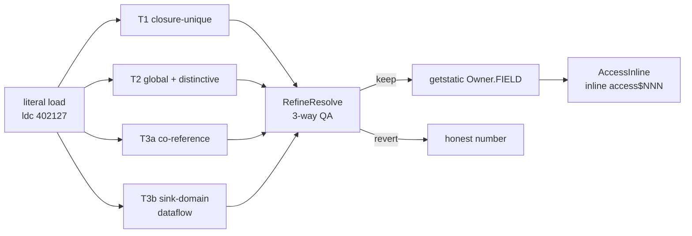
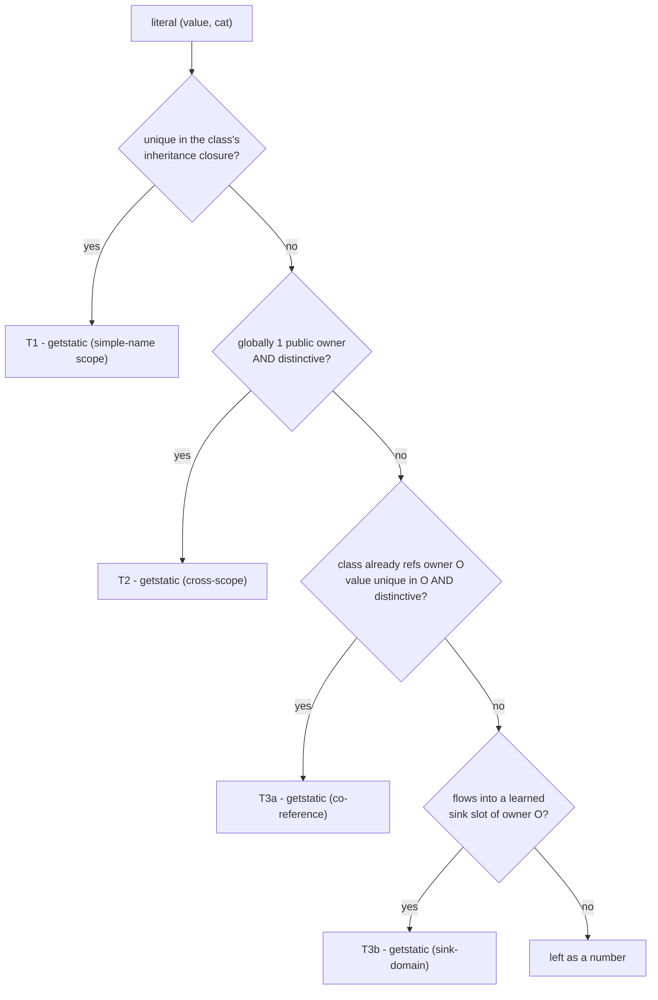
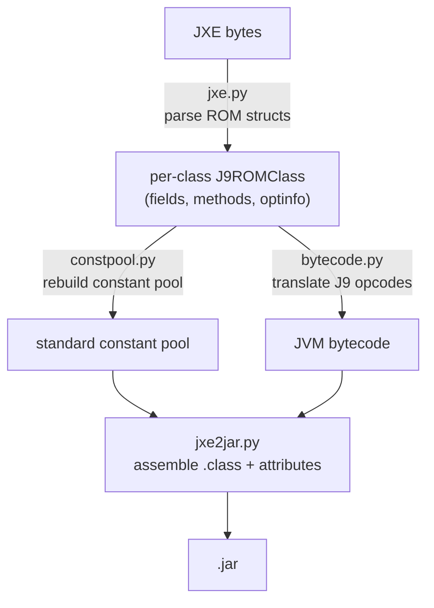

# jxe2jar

Tools and notes for converting **IBM J9/CDC JXE (rom.classes)** images back to standard
Java `.class` / `.jar`, then decompiling them into *readable* Java - with inlined
`static final` constant **names recovered** at the bytecode level.

The JXE is a romized image: J9 strips `StackMapTable`, line numbers, local-variable names
and folds `static final` constants into raw literals. This project undoes what *can* be
undone (structure, generics, inner classes, `throws`, constant names) and is honest about
what the ROM erased for good (real local names, line numbers).

## Contents

- [Pipeline at a glance](#pipeline-at-a-glance) - end-to-end diagram + one-shot commands
- [Repository Structure](#repository-structure)
- [Decompilation Workflow](#decompilation-workflow) - the 6 numbered steps
- [Constant un-inlining (ASM)](#constant-un-inlining-asm---recover-inlined-static-final-names) - tiers, the **distinctiveness gate**, sink-domain fixpoint, 3-way QA
- [Decompiler reference](#decompiler-reference) - full Vineflower / CFR option sets (per-tool docs in [`tools/README.md`](tools/README.md))
- [How conversion works](#how-conversion-works) - converter internals: [J9 opcode space](#the-j9-opcode-space--srcbytecodepy), [what `jxe.py` reads](#what-jxepy-reads-out-of-each-rom-class), and every classfile fixup
- [Testing Workflow](#testing-workflow) - [Usage Notes](#usage-notes) - [See Also](#see-also) - [Credits](#credits)

## Pipeline at a glance

Two independent halves: **converter** (`src/`, JXE -> verifiable `.jar`) and **recovery +
decompile** (`tools/`, `.jar` -> readable Java). The un-inliner sits *between* conversion
and decompilation - it rewrites folded literals back into `getstatic Owner.FIELD` so the
decompiler prints the real name, 100 % value-verified. End-to-end, one image:

```sh
tools/uninline/build.sh                                                     # once (JDK 17+)
python3 src/jxe2jar.py in.jxe out/base.jar                                 # convert
tools/combine.sh out/base.jar out/combined.jar --appimg <APPIMG>           # + bundles & app jars
tools/uninline/uninline.sh pipeline out/combined.jar out/final.jar out/doubtful.tsv 100
bash tools/vineflower.sh out/final.jar out/final-vf                        # decompile
python3 tools/nav_index.py out/final.jar out/nav                           # navigation index
```

## Repository Structure

| Path | Description |
|------|-------------|
| `src/` | **JXE -> JAR converter** (Python): `jxe.py` (ROM parser), `constpool.py` (constant pool), `bytecode.py` (J9 -> JVM bytecode), `jxe2jar.py` (classfile assembly + CLI), `common.py` |
| `tools/uninline/` | **ASM constant/accessor recovery suite** - self-contained fat jar (`Uninliner` - `SinkResolve` - `RefineResolve` - `AccessInline` - `VerifyResolve` - `TypeAudit`). See its [README](tools/uninline/README.md) |
| `tools/` | Merge (`combine.sh`), decompile drivers (`vineflower.sh`, `cfr.sh`) and post-processors (`decompile_fallback.py`, `fix_vf_artifacts.py`, `int2hex.py`, `nav_index.py`, `xref.py`) |
| `libs/` | 5 curated SDK jars (osgi.framework, osgi.util.tracker, commons.logging, xerces, commons-codec), fed to Vineflower as `--add-external` (type resolution) |
| `jvms/` | Bundled runtimes: Zulu **JDK 8** (mac/linux/win - the target 1.2/1.3 stdlib) + WM5 emulator for `jar2jxe` |
| `test/custom_edgecases/` | Exhaustive edge-case suite (Java 1.2) validating the converter via **JAR -> JXE -> JAR** round-trip |
| `vms/` | XP VM + WM5 emulator hosting the legacy `jar2jxe.exe` (round-trip direction) |
| `out/` | Conversion outputs, decompiled trees, logs, nav indexes |

## Decompilation Workflow

The converter only produces `.class`/`.jar`; turning that into readable Java is a separate
pipeline built around Vineflower (VF), with CFR as a fallback. The **constant un-inliner runs
between conversion and decompilation** - it is the step that makes the output read like source
instead of a wall of magic numbers.

1. **Convert** the JXE to a JAR:
   ```
   python3 src/jxe2jar.py input.jxe out/base.jar
   ```
   Converts *every* ROM class in the image, including the JDK / `java.*` ones.

2. **Combine** the lsd base with the firmware's OSGi bundles and app jars into one jar:
   ```
   tools/combine.sh out/base.jar out/combined.jar --appimg <APPIMG>
   ```
   `<APPIMG>` is the app image root (`.../advanced/<MODEL>-appimg`); it auto-adds `eso/bundles`,
   `eso/bundles_prod`, `eso/hmi/lsd/jars` (lsd wins name collisions). Folding them in *before*
   the un-inliner gives cross-corpus constant recovery and lets Vineflower resolve all app code
   intra-jar (no `--add-external` for it). Skip if you only want the bare lsd.

3. **Recover inlined constant names** with the ASM un-inliner - **before decompiling**:
   ```
   tools/uninline/uninline.sh pipeline out/combined.jar out/final.jar out/doubtful.tsv 100
   ```
   `javac` folds `static final` constants into raw literals, so a naive decompile shows
   `getChoiceModel(402127)` instead of the symbolic name. This pipeline rewrites each literal
   load back into a `getstatic Owner.FIELD` (value-preserving, decompile-only), so Vineflower
   then prints the real reference - **no regex over source text**. Every rewrite is proven
   `value(F) == literal` (0 mismatches on 106 k replacements). Full detail:
   [Constant un-inlining (ASM)](#constant-un-inlining-asm---recover-inlined-static-final-names).

4. **Decompile** with Vineflower:
   ```
   VF_JCL=libs/jcl/<FW>/jcl.jar tools/vineflower.sh out/final.jar out/final-vf
   ```
   `vineflower.sh` picks the newest bundled `vineflower-*.jar`, runs it on a JDK 17+ (VF 1.12
   targets class 61) while pointing `--include-runtime` at a bundled JDK 8 `rt.jar`, and uses
   the `jad` variable renamer (`tiny` crashes on these classes). `VF_JCL` (optional) resolves
   against the firmware's own JCL (see [`libs/jcl/`](libs/jcl/README.md)) instead of generic SE8.
   With the `InnerClasses` attribute present, nested classes render inline instead of as separate
   `Outer$Inner.java` files. See [Decompiling with Vineflower](#decompiling-with-vineflower).

5. **CFR fallback** for the rare method Vineflower cannot structure:
   ```
   python3 tools/decompile_fallback.py out/final-vf out/final.jar
   ```
   Finds any `// $VF: Couldn't be decompiled` stub and re-decompiles just that class with CFR,
   whose control-flow analysis handles cases VF's `DomHelper` rejects.

6. **Repair artifacts, index:**
   ```
   python3 tools/fix_vf_artifacts.py  out/final-vf --apply             # <unrepresentable> -> Object
   python3 tools/int2hex.py           out/final-vf --apply             # hex bitmasks/flags
   python3 tools/nav_index.py         out/final.jar out/nav            # who-uses / what-is-N index
   ```

The output is readable Java with inline nested classes, `throws` clauses, generics, symbolic
constant references, and hex bitmasks.

> **Optional but recommended** for real head-unit firmware (MIB `lsd.jxe`):
> - **step 2 `combine`** - folds the image's bundles + app jars in, so cross-corpus constant
>   recovery works and Vineflower resolves app code intra-jar. Skip only for a bare, standalone jxe.
> - **step 4 `VF_JCL`** - resolves against the firmware's own CDC JCL ([`libs/jcl/`](libs/jcl/README.md))
>   instead of a generic SE8 rt.jar, so `@Override`/generics/overloads bind to the real API.
>
> Both are safe to omit (you still get valid Java); they just make the result more complete and
> accurate. For a quick one-off jxe with no firmware context, run just steps 1, 3, 5-6.

## Constant un-inlining (ASM) - recover inlined `static final` names

`javac` folds `static final` constants into raw literals, so decompiled code shows
`getChoiceModel(402127)` instead of the symbolic name. The **[`tools/uninline/`](tools/uninline/)**
suite (self-contained ASM fat jar) rewrites the literal-load back into a `getstatic Owner.FIELD`,
so a re-decompile renders the real reference - **no regex on source text**. Every rewrite is
value-preserving (`VerifyResolve` proves `value(F)==literal`) and decompile-only.



| tier / pass | what it resolves |
|---|---|
| **T1** closure-unique | value is unique within the use-site class's inheritance closure |
| **T2** global + distinctive | globally-unique value passing strict distinctiveness (FQN/static-import context) |
| **T3a** co-reference | referenced-owner unique + distinctive |
| **T3b** sink-domain | learns each `(callee, method, argIndex)` slot's constant family from surviving getstatic args (self-seeded by T1/T2/T3a), then resolves non-distinctive literals flowing into a learned slot (fixpoint + field-write and switch-key-set domains) |
| **RefineResolve** | 3-way QA: **keep** by family-cohesion / distinctiveness / lexical overlap; **revert** genuine collisions to an honest number; the rest become inline `/* ?? maybe Owner.FIELD */` doubts |
| **AccessInline** | inlines synthetic `access$NNN` accessors to the real field/method access (reads the body, stack-guarded) |
| **VerifyResolve** | instruction-diff proving every replacement is `literal V -> getstatic F where value(F)==V` |
| **TypeAudit** | field ConstantValue vs descriptor, `ldc2_w` long/double typing, `jsr`/`ret`, modified-UTF-8 edges |

#### How a tier actually decides (down to the gate)

Every literal load is a candidate `(value, category)` where category in `{i (int-family
I/S/B/C/Z), j (long), f (float), d (double), s (String)}`. Matching is **category-exact** - a
getstatic must have identical stack behaviour - and T2/T3 only target **public fields in public
classes** (a getstatic from anywhere must be legal). The tiers are tried strongest-first:



The **distinctiveness gate** (`distinctiveNum`) is what stops a coincidence like `1024` (screen
width, shared by dozens of constants) from being named. A numeric value is *non-distinctive* -
and so **rejected** by T2/T3a - if any of these hold (`a = |value|`):

| rule | rejects | why |
|---|---|---|
| `a < 4096` | small ints | loop bounds, indices, bytecode-ish values |
| `a & (a-1) == 0` | powers of two | `1024`, `65536` - sizes, not IDs |
| `(a+1) & a == 0` | `2^n - 1` | `0xFFFF` all-ones masks |
| `bitCount(a) <= 2` | sparse flags | `0x10001` - bit combos |
| `a % 10 == 0` | decimal-round | `1000`, `50000` - quantities, timeouts |
| `a & 0xFF == 0` | byte-aligned | addresses/offsets |
| shifted `2^n-1` mask | `0x3FF << k` | shifted masks |

Strings need length >= 8 **and** at least one letter. Everything that survives the gate is a
"distinctive" value - the kind that is almost certainly a real symbolic ID, not arithmetic.

#### T3b sink-domain: recovering the *non*-distinctive ones

The distinctive gate deliberately gives up on round numbers - but many real constants (log
levels `1000`/`10000`, timeouts) *are* round. T3b recovers them by **where the literal flows**,
not its shape, using shallow intra-procedural dataflow (ASM `Analyzer<SourceValue>`). It learns
a slot's constant family from the getstatics T1/T2/T3a already placed:

| sink slot | keyed by | learned from |
|---|---|---|
| call-arg | `(callee owner, method, desc, argIndex)` | a `getstatic` passed as that argument |
| field write | `(owner, name, desc)` | a `getstatic` stored to that field |
| switch-on-param | `(method, param)` | switch keys that match an owner's whole constant set |

A slot is **trusted only when >= 2 distinct constants from a *single* owner back it**; then a
non-distinctive literal flowing into that slot is rewritten to that owner's uniquely-matching
constant. Because each pass adds getstatics that seed more slots, it runs to a **fixpoint**
(<= 6 iterations, monotonic - only facts added). Return-value domains are intentionally *not*
learned (utility methods returning status/ID/bool-as-int would poison the family).

#### RefineResolve - the 3-way QA that follows

Every getstatic-to-int is re-judged lexically (tokenize camelCase / `UPPER_SNAKE`, alias
`swdl/uota/gps/...`):

| verdict | when | result |
|---|---|---|
| **KEEP** | distinctive value **or** own-class constant **or** family-cohesion (>= 2 constants of that owner used in the class) **or** the field-name tokens overlap the using method/callee name | symbolic reference stays |
| **REVERT** | non-distinctive **and** foreign **and** a lone use of that owner **and** the enclosing method name carries a generic *quantity* word (`count/size/timeout/...`) with a natural value | back to an honest number |
| **FLAG** | any other non-distinctive + foreign case | number **+** inline `/* ?? maybe Owner.FIELD */` |

### Full pipeline

```sh
tools/uninline/build.sh                                       # build uninline.jar (JDK 17+)
python3 src/jxe2jar.py in.jxe out/base.jar                                 # convert (all classes)
tools/combine.sh out/base.jar out/combined.jar --appimg <APPIMG>          # + bundles & app jars
tools/uninline/uninline.sh pipeline out/combined.jar out/final.jar out/doubtful.tsv 100
bash tools/vineflower.sh out/final.jar out/final-vf                        # decompile
python3 tools/nav_index.py  out/final.jar out/nav                          # navigation index
# QA (optional):  tools/uninline/uninline.sh audit out/final.jar
```

On MU1316: **106014 literal->getstatic replacements, 0 value-mismatches**; ~95 % high-confidence
(globally-unique / own-class / distinctive), ~4.6 % flagged REVIEW, ~0.02 % genuine collisions
reverted to honest numbers (listed in `doubtful.tsv` for review). See
[`tools/uninline/README.md`](tools/uninline/README.md) for per-tool commands and guarantees.

## Decompiler reference

The individual tools - decompile drivers (`vineflower.sh`, `cfr.sh`), repair passes
(`decompile_fallback.py`, `fix_vf_artifacts.py`, `int2hex.py`) and analysis (`nav_index.py`, `xref.py`) - are each documented in
**[`tools/README.md`](tools/README.md)** with flags and examples. This section keeps the two
things too bulky to inline there: the full Vineflower and CFR option sets.

*Not recoverable* (romizer-stripped, confirmed by an optional-flags census): real local variable
names (Vineflower's `jad` type-based names are the ceiling), runtime annotations, line numbers,
`SourceFile`. Generics are **not** stripped - see [How conversion works](#how-conversion-works).
Log-level names (`Level.CRIT/ERR/WARN/INFO/DBG`) are recovered only where a `Level` constant is
in the class's closure; the round verbosity values (1000/10000/...) are non-distinctive, so
cross-scope `log(100000, ...)` calls stay numeric rather than risk a misleading name.

### Decompiling with Vineflower

**Recommendation:** Vineflower for primary analysis - fewer artifacts, cleaner inner-class
handling, no broken anonymous imports. Keep CFR output alongside for cross-referencing on the
rare method VF still can't do.

**Use VF 1.12.0, renamer `jad`.** Two settings decide how many methods come out as
`// $VF: Couldn't be decompiled` stubs on J9-converted classes:
- `--variable-renaming=jad` (not `tiny`): `tiny`/`TinyNameProvider` NPEs during LVT renaming.
- **VF 1.12.0** (not 1.11.2): 1.11.2's `ExitHelper.cleanUpUnreachableBlocks` NPEs on methods
  with unreachable blocks; fixed upstream in 1.12.0.

Use the wrapper, which sets all options, adds JDK8 `rt.jar`, and auto-includes `libs/*.jar`:

```sh
bash tools/vineflower.sh out/MU1316-lsd.jar                    # output: out/MU1316-lsd-vf/
bash tools/vineflower.sh out/MU1316-lsd.jar out/custom-dir     # custom output dir
```

**Two Javas are involved:**
- **VF 1.12.0 runs on Java 17+** (its own classes are class-file 61). The wrapper finds one via
  `/usr/libexec/java_home -v 17+`, or honours `VINEFLOWER_JAVA=/path/to/java17+/bin/java`.
- **`--include-runtime` stays JDK 8** under `jvms/zulu8.../` (its `rt.jar` is what the *target*
  1.2/1.3 firmware classes resolve against). That JDK8 must still be present.

<details>
<summary>Equivalent manual command</summary>

```sh
# note: run with a Java 17+ (VF 1.12.0 needs it); --include-runtime still points at JDK 8.
java17+ -Xmx30g -jar tools/vineflower-1.12.0.jar \
  --decompile-generics=true \
  --decompile-enums=true \
  --decompile-assert=true \
  --decompile-finally=true \
  --decompile-inner=true \
  --decompile-java4=true \
  --decompile-switch-expressions=true \
  --remove-bridge=true \
  --remove-synthetic=true \
  --remove-empty-try-catch=true \
  --remove-getclass=true \
  --hide-default-constructor=true \
  --hide-empty-super=true \
  --override-annotation=true \
  --inline-simple-lambdas=true \
  --use-lvt-names=true \
  --use-method-parameters=true \
  --boolean-as-int=true \
  --simplify-stack=true \
  --incorporate-returns=true \
  --pattern-matching=true \
  --ternary-in-if=true \
  --ensure-synchronized-monitors=true \
  --ignore-invalid-bytecode=true \
  --decompiler-comments=true \
  --dump-bytecode-on-error=true \
  --variable-renaming=jad \
  --rename-parameters=true \
  "--include-runtime=path/to/jdk8" \
  "--banner=" \
  "--indent-string=    " \
  --preferred-line-length=120 \
  --thread-count=14 \
  --old-try-dedup \
  --verify-merges \
  --warn-inconsistent-inner-attributes=false \
  --add-external=path/to/jdk8/jre/lib/rt.jar \
  --add-external=libs/commons-codec-1.16.0.jar \
  --add-external=libs/org.apache.commons.logging-4.3.1.jar \
  --add-external=libs/org.apache.xerces-2.9.0.jar \
  --add-external=libs/org.osgi.framework-1.10.0.jar \
  --add-external=libs/org.osgi.util.tracker-1.5.4.jar \
  out/MU1316-lsd.jar out/MU1316-lsd-vf
```

</details>

Key options:
- `--variable-renaming=jad --rename-parameters=true` - readable names derived from type (J9 ROM
  has no debug info / LocalVariableTable). Use `jad`, **not** `tiny`.
- `--decompile-inner --remove-synthetic --remove-bridge` - inline anonymous classes, hide
  compiler-generated methods.
- `--ignore-invalid-bytecode` - don't crash on J9-converted bytecode edge cases.
- `--include-runtime=path/to/jdk8` - gives VF JDK8's stdlib for `@Override` on `Runnable`,
  `Iterator`, `Comparable`, etc.
- `--add-external=path` - use `--add-external=` (not `-e`) when passing via scripts. Adds
  the `libs/` SDK jars as type info without including them in output. Skip
  `-javadoc.jar` / `-sources.jar`.

### Decompiling with CFR

```sh
tools/cfr.sh out/MU1316-lsd.jar out/MU1316-lsd-cfr
```

`cfr.sh` picks the newest bundled `cfr-*.jar`, applies the option set below, and hands CFR the
JDK 8 `rt.jar` plus any `libs/*.jar` as `--extraclasspath`.

<details>
<summary>Equivalent manual command</summary>

```sh
java -jar tools/cfr-0.152.jar out/MU1316-lsd.jar \
  --outputdir out/MU1316-lsd-cfr \
  --silent true \
  --comments true \
  --showversion false \
  --removeboilerplate true \
  --removeinnerclasssynthetics true \
  --decodelambdas true \
  --decodefinally true \
  --sugarasserts true \
  --sugarenums true \
  --sugarboxing true \
  --decodeenumswitch true \
  --decodestringswitch true \
  --arrayiter true \
  --collectioniter true \
  --tryresources true \
  --hidebridgemethods true \
  --hidelangimports true \
  --innerclasses true \
  --removebadgenerics true \
  --removedeadmethods true \
  --relinkconst true \
  --relinkconststring true \
  --liftconstructorinit true \
  --override true \
  --renameillegalidents true \
  --recover true \
  --allowcorrecting true \
  --tidymonitors true \
  --labelledblocks true \
  --usenametable true \
  --eclipse true \
  --extraclasspath path/to/jdk8/jre/lib/rt.jar
```

</details>

Key options: `--sugar*`/`--decode*` recover high-level constructs; `--removeboilerplate
--removedeadmethods --removebadgenerics` clean compiler artifacts; `--hidebridgemethods
--removeinnerclasssynthetics` hide synthetic access methods; `--recover --allowcorrecting`
best-effort recovery on broken bytecode.

The repair passes that run after decompilation (`fix_vf_artifacts.py`, `int2hex.py`,
`decompile_fallback.py`) are documented in
**[`tools/README.md`](tools/README.md)**.

## How conversion works

The converter parses a JXE image into per-class ROM structures, then reassembles each into a
standard `.class`. Most of that is a mechanical 1:1 mapping across four modules:



The sections below document the **non-obvious fixups** - the specific points where the J9 ROM
format diverges from a standard classfile, so a naive copy would produce something the JVM
verifier or a decompiler rejects. This table is the map; each row links to the detail.

| Fixup | Where | Why a naive copy breaks |
|---|---|---|
| [Classfile version <= 49](#classfile-version--srcjxe2jarpy) | `jxe2jar.py` | ROM strips `StackMapTable`; v >= 50 verifier *requires* it |
| [`invokespecial` -> `invokevirtual`](#devirtualized-invokespecial---invokevirtual--srcbytecodepy) | `bytecode.py` | J9 devirtualizes final calls; verifier rejects the receiver |
| [Constant-pool tail integrity](#constant-pool-tail-integrity--srcjxepy-srcconstpoolpy) | `jxe.py`, `constpool.py` | a dropped/garbage slot shifts every later CP index |
| [Modified UTF-8](#modified-utf-8-for-string-constants--srcconstpoolpy) | `constpool.py` | NUL / astral chars are rejected by the loader |
| [Empty ROM strings](#empty-rom-strings--srccommonpy) | `common.py` | a zero-length `J9UTF8` read as padding returns the *next* pool entry |
| [Float constant recovery](#float-constant-recovery--srcbytecodepy) | `bytecode.py` | ROM merges int/float -> ternary "no common supertype" |
| [InnerClasses reconstruction](#innerclasses-reconstruction-from-real-rom-metadata--srcjxe2jarpy-srcjxepy) | `jxe2jar.py`, `jxe.py` | correct nesting + inline decompilation |
| [EnclosingMethod](#enclosingmethod-attribute--srcjxe2jarpy-srcjxepy) | `jxe2jar.py`, `jxe.py` | anonymous/local classes inline into their method |
| [Exceptions / `throws`](#exceptions-attribute--throws-clauses--srcjxe2jarpy) | `jxe2jar.py` | recover declared checked exceptions |
| [Generics / `Signature`](#generics--signature-attribute--srcjxepy-srcjxe2jarpy) | `jxe.py`, `jxe2jar.py` | recover generic types at all three levels |

### The J9 opcode space  (`src/bytecode.py`)

J9 keeps the **standard JVM opcode numbering** for the whole `0x00-0xAB` range - `aconst_null`
is `0x01`, `bipush` `0x10`, `ldc` `0x12`, `getfield` `0xB4`, etc. - so most of a method body
copies through unchanged. Divergence is concentrated in two bands: the **return family** (`0xAC+`,
where J9 encodes the return *width* and sync/native variants in the opcode) and the **J9-private
high opcodes** (`0xCA-0xFF`). Those are what `bytecode.py` rewrites:

| J9 opcode(s) | value | -> standard | notes |
|---|---|---|---|
| `JBreturn0` `JBsyncReturn0` `JBreturnFromConstructor` `JBretFromNative0` | `AC AF E4 F4` | `return` | void return (sync/ctor/native collapse to one) |
| `JBreturn1` `JBsyncReturn1` `JBretFromNative1` | `AD B0 F5` | `ireturn`/`freturn`/`areturn` | width from method descriptor |
| `JBreturn2` `JBsyncReturn2` | `AE B1` | `lreturn`/`dreturn` | 2-slot return |
| `JBretFromNativeF/D/J` | `F6 F7 F8` | `freturn`/`dreturn`/`lreturn` | typed native returns |
| `JBgenericReturn` `JBreturnToMicroJIT` | `E5 F3` | inferred | return kind derived from descriptor |
| `JBaload0getfield` | `D7` | `aload_0` + `getfield` | J9 fuses the `this.field` prefix; expanded to two ops |
| `JBinvokeinterface2` (+`nop`) | `E7` | `invokeinterface` | J9's 2-byte form -> JVMS 4-byte (count from descriptor); the trailing `nop` absorbs the realignment |
| J9 wide load/store | `CB-D4` | `wide` (`C4`) + op | re-encoded to the standard `wide` prefix form |
| J9 wide `iinc` | - | `wide` `iinc` | same |
| `JBldc2lw` / `ldc2dw` | `14` / `F9` | `ldc2_w` | **distinct** opcodes -> long vs double is deterministic (no ambiguity) |
| `JBbreakpoint` `JBasyncCheck` `JBimpdep1` `JBimpdep2` | `CA FA FE FF` | `nop` | JIT/debug hooks, no runtime effect |
| `invokespecial` on `Object` finals | `B7` | `invokevirtual` | see [devirtualization fixup](#devirtualized-invokespecial---invokevirtual--srcbytecodepy) |

Two consequences ripple through the rest of translation: every rewrite that changes byte length
(`aload0getfield`, `invokeinterface2`, wide re-encoding, `ldc`->`ldc_w` when the CP index > 255)
shifts later offsets, so **branch/switch targets and the exception table are recomputed against an
output-offset map**; and because J9 has no int/float opcode distinction, a **stack-simulation
pre-pass** ([Float constant recovery](#float-constant-recovery--srcbytecodepy)) decides which
`ldc` constants are float before any of this runs.

### What `jxe.py` reads out of each ROM class

Before any of that, `jxe.py` walks the `J9ROMClass` structures (not a classfile - a romized
image with SRP/self-relative pointers). Each row below is a field the reader must locate exactly,
because a wrong offset shifts everything after it:

| ROM source | -> classfile | gate / location |
|---|---|---|
| `romConstantPoolCount` + CP slots | constant pool | placeholder on `EOFError` to keep indices aligned |
| `J9ROMMethod` {modifiers, bytecode, exceptions} | methods + `Code` | modifier bit `0x02000000` = generic `Signature` (u32 after bytecode) |
| `J9ROMField` {access, const slots} | fields + `ConstantValue` | access bit `0x40000000` = generic `Signature` |
| `outerClassName`, `memberAccessFlags`, `innerClasses` | `InnerClasses` | header layout: `outerClassName` one word later than the old map assumed |
| optional-info SRPs (popcount-indexed) | `Signature` / `EnclosingMethod` | class flag `0x02` = class Signature, `0x40` = EnclosingObject, `0x80` = simpleName |
| `throwExceptions` | `Exceptions` | - |

### Classfile version  (`src/jxe2jar.py`)
The version is inferred from class/field/method flags (minimum 46), bumped to 49 when
synthetic/enum/annotation/bridge/varargs flags are present so `javac`/`javap` accept the output.

**Never >= 50.** The J9 romizer strips `StackMapTable`, which the type-checking verifier (class
version >= 50) *requires* - so any >= 50 stamp yields a class that fails `-Xverify:all` with
*"Expecting a stack map frame"*. Version <= 49 keeps every class on the old inference verifier,
which needs no stack maps. (An earlier heuristic bumped to 51 on a raw `0xBA in bytecode`
byte-scan for invokedynamic; that false-positives on any class whose bytecode merely contains a
`0xBA` operand byte, and the converter emits no `BootstrapMethods` anyway. Removed - CDC/J9 ROM
images are pre-invokedynamic, so capping at 49 keeps every class verifiable.)

### Devirtualized `invokespecial` -> `invokevirtual`  (`src/bytecode.py`)
- **Problem:** J9's romizer devirtualizes `invokevirtual` of a *final* method into `invokespecial`
  (a final method binds statically). Standard bytecode forbids `invokespecial` to a superclass
  method on a receiver not assignable to the current class, so HotSpot's verifier rejects it with
  *"Incompatible object argument for invokespecial"*. The near-universal trigger is the
  `x.getClass()` idiom - the NPE-guard the compiler inserts, and `this.getClass() != o.getClass()`
  in `equals()` - where the receiver is a parameter, not `this`.
- **Fix:** during bytecode translation, `invokespecial` whose target is one of
  `java/lang/Object`'s final methods (`getClass`, `wait`, `notify`, `notifyAll`) is rewritten to
  `invokevirtual`. Safe because these are final: virtual and non-virtual dispatch are identical
  and no `super`-call is possible. Constructors (`<init>`), private-method calls, and genuine
  `super.m()` (receiver `this`, verifies fine) are left untouched. Resolution needs the
  methodref's class+name, so both const-pool build paths (`J9CONST.REF` and the
  `J9CONST.LONG`-decoded ref) carry `ref_class`/`ref_name` into the transform table.
- **Result:** the affected classes verify. (A pre-existing bug masked on `v51` classes by the
  missing-stack-map error; it surfaced only once versions were capped at 49. It never affected
  decompilation - VF/CFR render these classes fine either way.)

### Constant-pool tail integrity  (`src/jxe.py`, `src/constpool.py`)
Verifying the whole jar with `-Xverify:all` surfaced three narrow correctness bugs in how the
ROM constant pool is read:
- **Dropped CP slot -> index shift.** The reader looped `rom_constant_pool_count` times and, on
  `EOFError` from a slot whose pointer-chase ran off the end (J9 padding in the ram/rom-count
  gap), silently skipped the entry - leaving the list one short, shifting every later CP index
  by one and silently rewiring all references after it. Fixed by appending a placeholder constant
  on `EOFError` so list indices stay aligned with ROM indices (`jxe.py`).
- **Null/garbage CP entries reach the classfile.** Those padding slots can decode to a
  `CONSTANT_Class` with an empty name, or a field/method ref whose name is really a type
  descriptor (`Lx/Y;`) or whose descriptor is garbage (`JJTANDNODE`) - all rejected by the loader.
  They are always unreferenced. `constpool.py` substitutes a valid placeholder name
  (`java/lang/Object` for classes) and, via `_sanitized_ref`, replaces an illegal member
  name/descriptor with an inert `_pad:Ljava/lang/Object;`. The descriptor check is exact (a
  primitive descriptor is a single char - `JJTANDNODE` is *not* `long` just because it starts `J`).
- **Net result:** whole-jar `-Xverify:all` -> **0 VerifyError, 0 ClassFormatError** (remaining
  non-OK are benign: `java.*` classes the app loader refuses to define, and classes whose
  supertypes live only in the external `libs/` jars).

### Modified UTF-8 for string constants  (`src/constpool.py`)
Classfile `CONSTANT_Utf8` uses JVM **Modified UTF-8** (JVMS 4.4.7), not standard UTF-8. The
converter previously wrote `str.encode("utf-8", "surrogatepass")`, which differs in two
loader-enforced ways: `U+0000` must be `0xC0 0x80` (never a bare `0x00`), and a supplementary
char must be its UTF-16 surrogate pair as two 3-byte sequences (never a single 4-byte sequence).
Plain ASCII/BMP text is identical, so this only bites strings carrying NULs or astral chars -
e.g. `java.text.CollationRules`, whose rule string embeds `U+0000..U+001F`, was rejected with
*"Illegal UTF8 string in constant pool"*. `_encode_utf8` now emits proper Modified UTF-8.
(Surfaced by the JDK/`java.*` classes, which the converter now always includes.)

### Empty ROM strings  (`src/common.py`)
A ROM string is a `J9UTF8`: **LE `u16` length**, then that many bytes of Modified UTF-8, padded
to a 2-byte boundary. Records sit back-to-back in one shared pool, so an empty string is just
`00 00` immediately followed by the next record. The reader used to try a "pad+length" layout
first (`u16` padding, `u16` length, data) and accept it whenever the padding word was zero -
which is true for *exactly one* input: an empty string. Every `""` therefore consumed the
length **and data** of whichever record happened to follow it in the pool. On MU1326 that was
`isNativeLittleEndian`, which turned up as a bogus string constant in 1086 classes (`java.io.File`,
`java.net.URI`, `java.lang.Class`, ...). The pad+length path is gone; `_read_j9utf8_at` reads the
real layout and treats a zero length word as the empty string it is. Covered by
`test/test_rom_string.py`.

### Float constant recovery  (`src/bytecode.py`)
J9 stores both `int` and `float` as `J9CONST.INT` (type 0) - the ROM format has **no int/float
distinction**. Two passes recover the type:
- **Linear stack simulation** (`_find_float_constants`) walks each method before translation,
  tracking which `ldc`/`ldc_w` entries flow into float-consuming operations (`fstore`, `fadd`,
  `fcmpg`, `putfield` with `F` descriptor, `invoke*` with `F` parameters, ...). Identified entries
  are reclassified `CONST.INTEGER -> CONST.FLOAT` via `new_cp_transform`. It models `getfield`,
  array loads, and other opcodes to keep parameter positions aligned with invoke descriptors.
- **Ternary branches** (`_find_ternary_float_constants`): the linear pass clears its stack at
  every branch, so a float constant in one arm of `cond ? A : B` is never seen flowing into the
  consumer - it stays `int`, the other arm stays `float`, and decompilers throw *"No common
  supertype for ternary expression"*. This pass pattern-matches the ternary shape
  (`ifXX L1 ; armA ; goto L2 ; L1: armB ; L2:`) and, when one arm's terminal push is an int-ldc
  and the other's is unambiguously float, reclassifies the int-ldc to float. int-vs-float is the
  only trigger, so genuine ints are never mis-typed. This alone took the MU1316 LSD decompile
  from 15 -> ~1 un-decompilable class. Bounds on the `goto`/`goto_w` offset (`T < l2 <= n`) are
  load-bearing - without them a malformed offset crashes the whole class's conversion.

Constant handling also covers: `J9ROMField` constant slots emitted as `ConstantValue` for static
final fields (int/float/long/double/String), recovered even when the CP slot is placeholder;
INTEGER/FLOAT/LONG/DOUBLE/STRING/REF with preserved descriptors; and J9 ROM "LONG" slots decoded
into proper field/method refs using ROM base offsets.

### InnerClasses reconstruction from real ROM metadata  (`src/jxe2jar.py`, `src/jxe.py`)
The `InnerClasses` attribute is rebuilt from the **actual J9 ROM fields**, not guessed from `$`
names. J9 preserves per class (unlike `StackMapTable`): `outerClassName`, `memberAccessFlags`,
the `innerClasses` list and, as optional info, `simpleName` (flag `0x80`) and an
`EnclosingMethod` marker (flag `0x40`). `build_inner_meta` reads these (the header layout was
corrected - `outerClassName` sits one word later than the old field map assumed), so each entry's
outer/name/flags are exact - a nested interface keeps `interface+abstract`, a private member stays
`private`, etc.

Per class, the entry set mirrors javac: itself, its enclosing nest chain, its members, and every
nested class it references. References are collected from the constant pool, the
superclass/interfaces (which live outside the CP), all field/method descriptors, and - crucially -
the *output* constant pool's UTF-8 entries, since some refs (e.g. a synthetic `<init>(Outer$1)`
accessor call) are reconstructed during conversion and never appear as J9 ROM constants.

One flag J9 leaves at 0 is recovered: the `ACC_STATIC` on a synthetic/anonymous nested class. A
non-static inner class captures its enclosing instance in a synthetic `this$0` field, so that
field's *absence* means the class is static - an exact, build-independent tell. (An earlier
`ACC_FINAL` heuristic only correlated on some builds.)

Where the original pre-romization jars are available, the reconstructed `InnerClasses` matches
them byte-for-byte, and it holds across different ROM builds/regions.

### EnclosingMethod attribute  (`src/jxe2jar.py`, `src/jxe.py`)
Anonymous and local classes also carry a J9 `EnclosingObject` record (optional flag `0x40`):
`{ classRefCPIndex, nameAndSignature }`. It is read into the enclosing class and, when the ROM
kept it, the enclosing method's name+descriptor, then emitted as the JVMS 4.7.7 `EnclosingMethod`
attribute (`class_index` + optional `method_index` NameAndType).

This matters for decompilation: without it a decompiler treats every inner class as an
independent top-level class, so anonymous classes come out as separate `Outer$N.java` files,
synthetic `access$NNN` accessors get stripped from the outer class but are still called from the
inners (unresolved references), and private-inner constructors keep their synthetic disambiguator
argument (wrong arity). With `EnclosingMethod` present, Vineflower inlines anonymous classes into
their enclosing method and resolves all of these. One residual VF artifact (`<unrepresentable>`
on a nested anonymous class's synthetic outer-`this` field) is cleaned by
`tools/fix_vf_artifacts.py`.

### Exceptions attribute / `throws` clauses  (`src/jxe2jar.py`)
J9 keeps each method's declared checked exceptions (`throw_exceptions`), which the converter used
to drop - so decompiled methods showed no `throws`. The standard `Exceptions` attribute is now
emitted from them, and matches the original jars byte-for-byte where those are available.

### Generics / `Signature` attribute  (`src/jxe.py`, `src/jxe2jar.py`)
Contrary to an earlier assumption, the J9 romizer **keeps** the generic `Signature` at all three
levels - it was the *reader* that dropped them. An empirical optional-info census (counts, not
prose) proved it: class-level `Signature` sits at class optional-flags bit `0x02` (SRP index =
popcount of flags below it); method-level at `J9ROMMethod` modifier bit `0x02000000` (the u32
after the bytecode, which the parser used to read and discard); field-level at `J9ROMField`
access flag `0x40000000` (what the old code mislabelled a dead `const_value3`). All are now read
and emitted as JVMS `Signature` attributes (version bumped to 49), recovering **1117 signatures**
on MU1316 - verified with `javap` (`GPair<F,S>`, `GList<T>`, `create(A,B)->GPair<A,B>`).

*What is genuinely not recoverable* (proven stripped by the same census, 0 across the whole
image): `LocalVariableTable`/`LineNumberTable` (real local/param names + line numbers),
`StackMapTable`, runtime `Annotations`, `SourceFile`. So locals keep Vineflower's `jad`
type-based names - a hard ROM limit, not a converter gap.

### Other translation details  (`src/bytecode.py`, `src/jxe2jar.py`)
- **Bytecode:** wide opcodes normalized to JVM `wide`; `invokeinterface` count computed from the
  descriptor; `ldc` promoted to `ldc_w` when CP index > 255; J9 prefix opcodes expanded (e.g.
  implicit `aload_0`); branch/switch offsets and switch padding rewritten using output offset
  maps; invalid/missing CP refs handled defensively instead of crashing.
- **J9 return opcodes** mapped to standard JVM returns by method signature: `JBreturn0` /
  `JBsyncReturn0` / `JBreturnFromConstructor` / `JBretFromNative0` -> `return`; `JBreturn1` /
  `JBsyncReturn1` / `JBretFromNative1` -> `ireturn`/`freturn`/`areturn`; `JBreturn2` /
  `JBsyncReturn2` -> `lreturn`/`dreturn`; `JBretFromNativeF/D/J` -> typed returns;
  `JBgenericReturn`/`JBreturnToMicroJIT` -> inferred from descriptor. J9 runtime/debug opcodes
  (`JBasyncCheck`, `JBbreakpoint`, `JBimpdep1`, `JBimpdep2`) -> `nop`.
- **Code attribute:** always JVM-standard `u16/u16/u32` layout (stack/locals/code_len); exception
  table offsets rewritten after bytecode expansion.
- **Flags:** `--strip-synthetic` clears `ACC_SYNTHETIC` on classes/methods/fields for strict
  tooling (preserved by default).

## Testing Workflow

The converter is validated through edge-case tests and a **JAR -> JXE -> JAR** round-trip:

1. Build edge-case JAR: `sh test/custom_edgecases/build.sh`
2. Convert JAR -> JXE with `jar2jxe.exe` (see [`vms/xp/README.md`](vms/xp/README.md))
3. Convert JXE -> JAR with Python: `python3 src/jxe2jar.py input.jxe output.jar`

## Usage Notes

- Every class in the image is converted (including JDK / `java.*`); there is no skip list.
- `EnclosingMethod` is synthesized for ROM-erased anon classes (`Outer$N`) by default so
  decompilers inline them; pass `--dont-infer-enclosing` to turn that off.
- `ACC_SYNTHETIC` is preserved by default; `--strip-synthetic` for strict `javap` on 45.0 classes.
- Classfile versions are inferred from flags (minimum 46) and never exceed 49 (keeps every class
  on the stack-map-free inference verifier; see [Classfile version](#classfile-version--srcjxe2jarpy)).
- Some large binaries/ISOs are referenced via `.url` files pointing to original archives
  (`vms/xp/*.iso.url`).

## See Also

- [`tools/README.md`](tools/README.md) - every decompile/recovery tool, with flags and examples
- [`tools/uninline/README.md`](tools/uninline/README.md) - the ASM constant/accessor recovery suite
- [`src/README.md`](src/README.md) - format knowledge and implementation details
- [`test/custom_edgecases/README.md`](test/custom_edgecases/README.md) - test coverage list
- [`vms/xp/README.md`](vms/xp/README.md) - WM5 emulator + XP VM instructions

## Credits

Thanks to the original repo, forks, and contributors:
- https://github.com/moradek/jxe2jar
- https://github.com/andrewleech/jxe2jar
