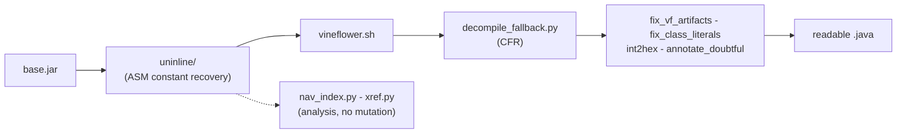

# tools - decompile pipeline & recovery

Everything that turns a converted `.jar` (output of `src/jxe2jar.py`) into *readable* Java.
Grouped by role. Steps 2-7 below are all **optional** refinements - each improves readability
or navigability; none is required for a plain decompile.



| tool | kind | one-liner |
|------|------|-----------|
| [`uninline/`](uninline/README.md) | ASM suite | recover inlined `static final` **names** (literal -> `getstatic`), value-verified |
| [`vineflower.sh`](#vineflowersh) | driver | primary decompiler (VF 1.12.0, `jad` renamer, JDK8 runtime) |
| [`cfr.sh`](#cfrsh) | driver | alternate decompiler (CFR 0.152) for cross-referencing |
| [`decompile_fallback.py`](#decompile_fallbackpy) | repair | re-decompile VF stubs with CFR |
| [`fix_vf_artifacts.py`](#fix_vf_artifactspy) | repair | fix `<unrepresentable>` / keyword-identifier artifacts |
| [`fix_class_literals.py`](#fix_class_literalspy) | repair | Java 1.2 `class$()` -> `Foo.class` |
| [`int2hex.py`](#int2hexpy) | repair | decimal bitmasks/flags -> hex |
| [`annotate_doubtful.py`](#annotate_doubtfulpy) | repair | inline `/* ?? maybe Owner.FIELD */` at low-confidence constants |
| [`nav_index.py`](#nav_indexpy) | analysis | "what is value N" / "who uses this constant" index |
| [`xref.py`](#xrefpy) | analysis | bytecode cross-reference (callers/uses/dump) |

Bundled jars: `vineflower-1.12.0.jar`, `cfr-0.152.jar`, `jd-cli.jar` (unused legacy), plus
`uninline/uninline.jar` (built).

---

## Constant recovery - `uninline/`

The headline step: `javac` folds `static final` constants into raw literals, so a naive
decompile shows `getChoiceModel(402127)` instead of the symbolic name. The `uninline/` suite
rewrites each literal load back into `getstatic Owner.FIELD` at the **bytecode** level
(value-preserving, 100 % verified), so the decompiler prints the real name. Run it on the
converted jar **before** Vineflower. Full detail - tiers, QA, guarantees - in
**[`uninline/README.md`](uninline/README.md)**.

```sh
tools/uninline/build.sh                                                  # build once (JDK 17+)
tools/uninline/uninline.sh pipeline base.jar final.jar doubtful.tsv 100  # T1/T2/T3a->sink->refine->access
tools/uninline/uninline.sh verify   base.jar final.jar                   # 0 value-mismatch
tools/uninline/uninline.sh audit    final.jar                            # type-ambiguity audit
```

`doubtful.tsv` feeds [`annotate_doubtful.py`](#annotate_doubtfulpy).

---

## Decompile drivers

### `vineflower.sh`
Primary decompiler. Picks the newest bundled `vineflower-*.jar`, runs it on a **JDK 17+**
(VF 1.12.0 is class-file 61) while pointing `--include-runtime` at the bundled **JDK 8** `rt.jar`,
uses the `jad` variable renamer, and auto-adds `libs/*.jar` as `--add-external` type info.

```sh
bash tools/vineflower.sh final.jar                 # -> final-vf/  (sibling dir)
bash tools/vineflower.sh final.jar out/custom-dir  # custom output dir
VINEFLOWER_JAVA=/path/to/java17/bin/java bash tools/vineflower.sh final.jar   # pin the JDK17+
```

Why these choices (both decide the stub count on J9-converted classes):
- `--variable-renaming=jad`, **not** `tiny` - `TinyNameProvider` NPEs during LVT renaming.
- **VF 1.12.0**, not 1.11.2 - 1.11.2's `ExitHelper.cleanUpUnreachableBlocks` NPEs on unreachable
  blocks.

Full option set and the equivalent manual `java ...` command are in the main
[README -> Decompiling with Vineflower](../README.md#decompiling-with-vineflower).

### `cfr.sh`
Alternate decompiler (CFR 0.152), useful for cross-referencing and for methods VF can't
structure. Picks the newest `cfr-*.jar`, applies the sugar/recover option set, and hands CFR the
JDK 8 `rt.jar` + `libs/*.jar` as `--extraclasspath`.

```sh
tools/cfr.sh final.jar out/final-cfr
```

Option set + manual command: [README -> Decompiling with CFR](../README.md#decompiling-with-cfr).

---

## Decompile repair (post-processing)

Run in this order after Vineflower. All support a dry-run (default) and `--apply` (in place).

### `decompile_fallback.py`
Vineflower occasionally emits a `// $VF: Couldn't be decompiled` stub for a method whose control
flow its `DomHelper` can't structure (a genuine VF bug, e.g. `com.ibm.oti.util.DefaultPolicy.
loadKeystore`). This scans the decompiled tree for such stubs and, per affected class,
re-decompiles it from the jar with CFR and replaces the `.java`. Needs `cfr-*.jar`.

```sh
python3 tools/decompile_fallback.py out/final-vf out/final.jar --dry-run   # list stubs
python3 tools/decompile_fallback.py out/final-vf out/final.jar             # re-decompile with CFR
```

### `fix_vf_artifacts.py`
When anonymous classes are inlined (the `EnclosingMethod` attribute enables this), Vineflower
occasionally can't name a nested anonymous class's synthetic outer-`this` field and emits the
placeholder `<unrepresentable>`; it also sometimes emits Java keywords as identifiers. This
repairs both so the source compiles/reads cleanly.

```sh
python3 tools/fix_vf_artifacts.py out/final-vf            # report
python3 tools/fix_vf_artifacts.py out/final-vf --apply    # <unrepresentable> -> Object, etc.
```

### `fix_class_literals.py`
Java 1.2 code uses a synthetic `class$()` method instead of `Foo.class`. Neither VF nor CFR
collapses it from J9-converted bytecode, leaving ternaries like
`(class$foo$Bar == null ? (class$foo$Bar = class$("foo.Bar")) : class$foo$Bar)`. This replaces
them with `foo.Bar.class` and removes the leftover synthetic `static Class class$...` fields and
`class$()` methods. Works on both VF and CFR output.

```sh
python3 tools/fix_class_literals.py out/final-vf              # report
python3 tools/fix_class_literals.py out/final-vf --apply      # apply
python3 tools/fix_class_literals.py out/final-vf --apply -v   # verbose (per file)
```

### `int2hex.py`
Decompilers emit all integers in decimal; bitmasks/flags read better in hex (`6291488 -> 0x600020`).
Scores each literal (power of 2, all-ones mask, nibble-aligned, sparse/dense bits, nearby
`&`/`|`/`~` or hex on the line) and converts only those above a threshold.

```sh
python3 tools/int2hex.py out/final-vf                     # report
python3 tools/int2hex.py out/final-vf --apply             # apply (default threshold 2.0)
python3 tools/int2hex.py out/final-vf --threshold 1.0 --apply   # aggressive (config IDs too)
python3 tools/int2hex.py out/final-vf --report report.csv       # CSV for manual review
```

### `annotate_doubtful.py`
Consumes the `doubtful.tsv` from `uninline refine`. For each low-confidence resolution (reverted
to an honest number), inserts an inline `/* ?? maybe Owner.FIELD */` right at that literal in the
`.java` - uncertainty where it lives, instead of a TSV nobody reads. Confident resolutions stay
clean symbolic references. Only ~dozens of sites.

```sh
python3 tools/annotate_doubtful.py out/final-vf out/doubtful.tsv           # would-annotate count
python3 tools/annotate_doubtful.py out/final-vf out/doubtful.tsv --apply   # insert comments
```

---

## Analysis (no mutation)

### `nav_index.py`
After un-inlining, every recovered constant is a real `getstatic Owner.NAME`, so you can finally
ask "what is number N?" and "who uses this constant?". Builds a searchable index from the final
jar (reads constant pools - exact, not text):

```sh
python3 tools/nav_index.py out/final.jar out/nav
```
Writes into `out/nav/`: `constants_by_owner.tsv` (catalog), `constants_by_value.tsv` (value ->
owner.NAME), `const_xref.tsv` (constant -> referrers), `recovery_report.md` (per-package + global
stats). The output dir is an explicit argument - pass a per-image dir (e.g. `out/nav-MU1339`) to
keep runs separate.

### `xref.py`
General bytecode cross-reference (any jar, not just recovered constants). Reads every class's
constant pool - precise, unlike grepping decompiled text.

```sh
python3 tools/xref.py out/final.jar --callers de/.../MapInterface.validateGELicenseState
python3 tools/xref.py out/final.jar --uses    de/.../MapInterface     # what it references
python3 tools/xref.py out/final.jar --dump    xref.txt                # full reverse index
```

---

## Not recoverable (ROM-stripped)

Real local/parameter names, line numbers, `StackMapTable`, runtime annotations, `SourceFile` -
proven stripped by the J9 romizer (optional-flags census, 0 across the image). Vineflower's `jad`
type-based names are the ceiling for locals. Generics are **not** stripped - the converter
recovers them (see main [README -> How conversion works](../README.md#how-conversion-works)).
